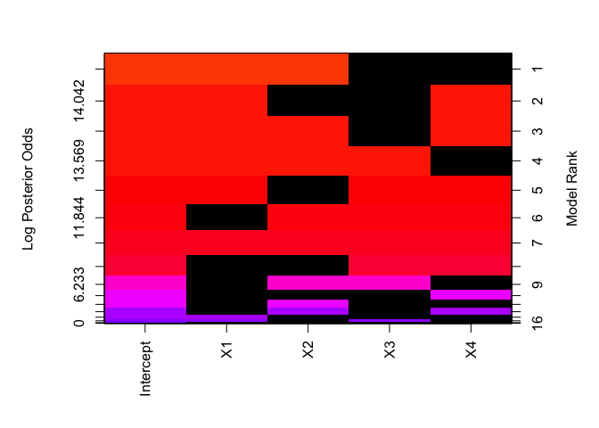

<!-- README.md is generated from README.Rmd. Please edit that file -->
[BAS: An R package for Bayesian Model Averaging using Adaptive Samping](https://github.com/merliseclyde/BAS)
============================================================================================================

The `BAS` [R](http://r-project.org) package is designed to provide an easy to use package and fast code for implementing Bayesian Model Averaging and Model Selection in R using state of the art prior distributions for linear and generalized linear models. All of the prior distributions in `BAS` are based on Zellner's g-prior or mixtures of g-priors. These have been shown to be consistent and have a number of computational advantages. BAS implements two main algorithms for sampling from the space of potential models: an adaptive sampling without replacement algorithm and a MCMC algorithm that utilizes swapping to escape from local modes. More details are in the R man pages.

Current build and test coverage status courtesy Travis: [](https://travis-ci.org/merliseclyde/BAS)

Some CRAN statistics: [](http://cran.rstudio.com/web/packages/BAS/index.html) [](http://cran.rstudio.com/web/packages/BAS/index.html)

Stable release DOI [](http://dx.doi.org/10.5281/zenodo.59497)

Installation
------------

The stable version [](https://cran.r-project.org/package=BAS) can be installed easily in the `R` console like any other package:

``` r
install.packages('BAS')
```

On the other hand, I welcome everyone to use the most recent version of the package with quick-fixes, new features and probably new bugs. It's currently hosted on [GitHub](https://github.com/merliseclyde/BAS). To get the latest development version from [GitHub](https://github.com/merliseclyde), use the `devtools` package from [CRAN](https://cran.r-project.org/package=devtools) and enter in `R`:

``` r
devtools::install_github('merliseclyde/BAS')
```

Installing the package from source does require compilation of C and FORTRAN code as the library makes use of BLAS and LAPACK for efficient model fitting. See [CRAN manuals](https://cran.r-project.org/doc/manuals/r-devel/R-admin.html) for installing packages from source under different operating systems.

Usage
-----

To begin load the pacakge:

``` r
library(BAS)
```

The two main function in `BAS` are `bas.lm` and `bas.glm` for implementing Bayesian Model Averaging and Variable Selection and have a syntax similar to the `lm` and `glm` functions respectively. To illustate using `BAS` on a simple example using the Zellner-Siow Cauchy prior enter

``` r
data(Hald)
hald.ZS = bas.lm(Y ~ ., data=Hald, prior="ZS-null", modelprior=uniform(), method="BAS")
```

`BAS` has `summary`, `plot` `coef`, `predict` and `fitted` functions like the `lm`/`glm` functions. Images of the model space highlighting which varaible are important may be obtained via

``` r
image(hald.ZS)
```



Run `demo("BAS.hald")` or `demo("BAS.USCrime")` or see the package vignette for more examples and decription of the functions.
