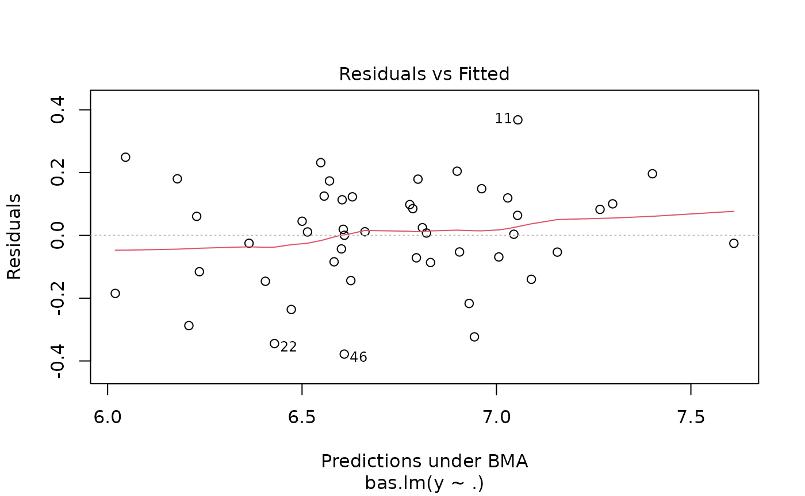
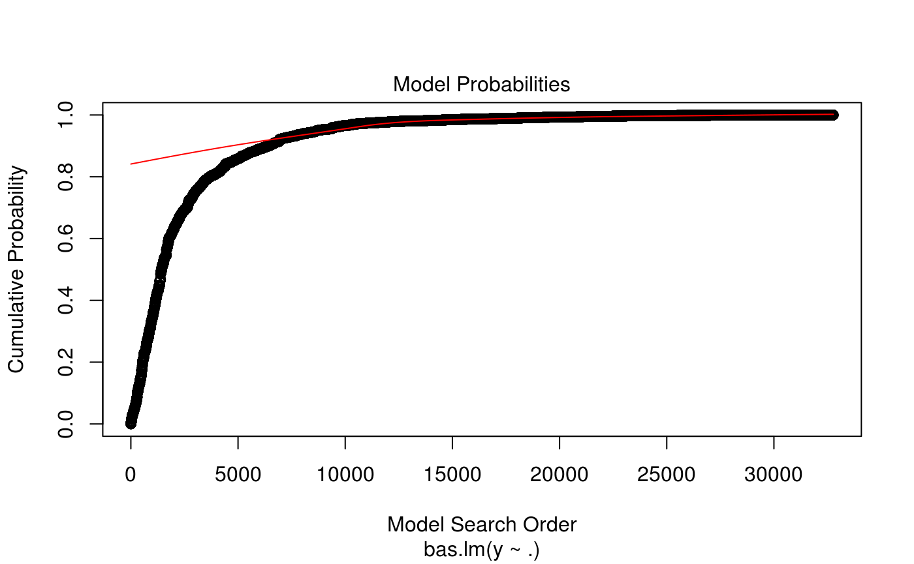
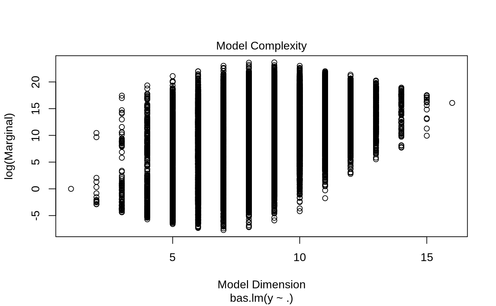
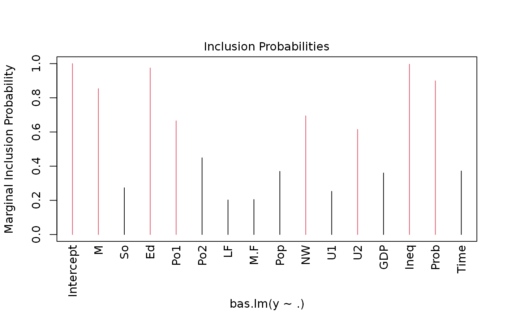
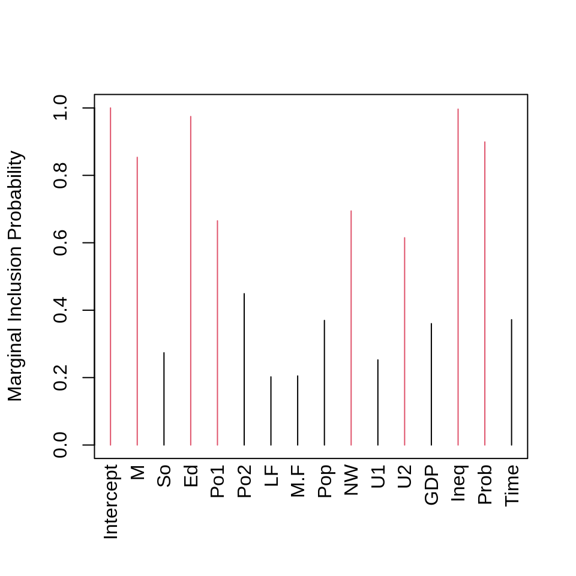
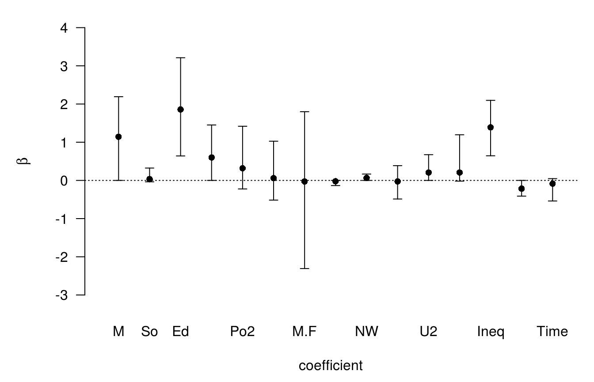
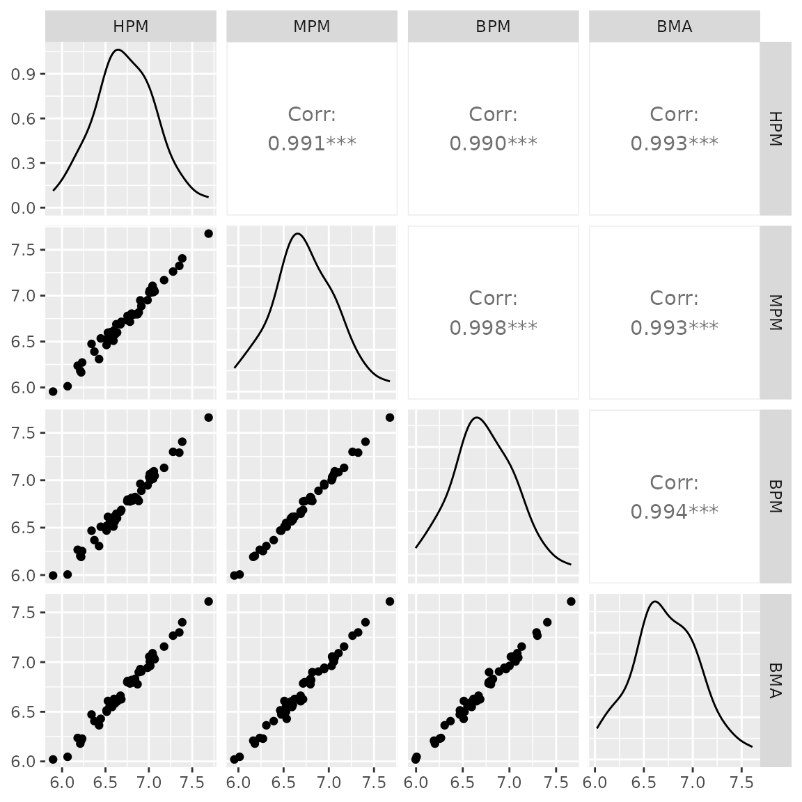
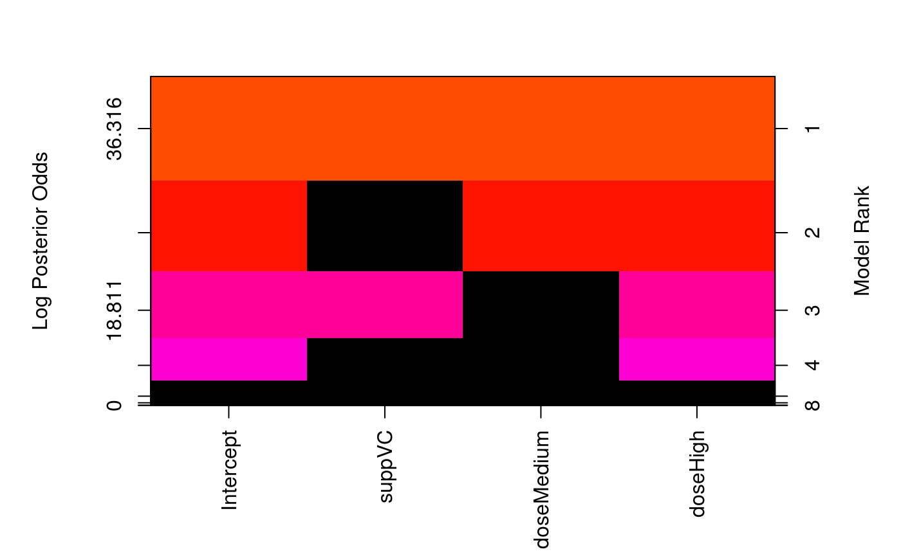

# Using the Bayesian Adaptive Sampling (BAS) Package for Bayesian Model Averaging and Variable Selection

The `BAS` package provides easy to use functions to implement Bayesian
Model Averaging in linear models and generalized linear models. Prior
distributions on coefficients are based on Zellner’s g-prior or mixtures
of g-priors, such as the Zellner-Siow Cauchy prior or mixtures of
g-priors from [Liang et al
(2008)](https://doi.org/10.1198/016214507000001337) for linear models,
as well as other options including AIC, BIC, RIC and Empirical Bayes
methods. Extensions to Generalized Linear Models are based on the
mixtures of g-priors in GLMs of [Li and Clyde
(2019)](https://doi.org/10.1080/01621459.2018.1469992) using an
integrated Laplace approximation.

`BAS` uses an adaptive sampling algorithm to sample without replacement
from the space of models or MCMC sampling which is recommended for
sampling problems with a large number of predictors. See [Clyde, Littman
& Ghosh](https://doi.org/10.1198/jcgs.2010.09049) for more details for
the sampling algorithms.

## Installing BAS

The stable version can be installed easily in the `R` console like any
other package:

``` r
install.packages("BAS")
```

On the other hand, I welcome everyone to use the most recent version of
the package with quick-fixes, new features and probably new bugs. To get
the latest development version from
[GitHub](https://github.com/merliseclyde), use the `devtools` package
from [CRAN](https://cran.r-project.org/package=devtools) and enter in
`R`:

``` r
devtools::install_github("merliseclyde/BAS")
```

As the package does depend on BLAS and LAPACK, installing from GitHub
will require that you have FORTRAN and C compilers on your system.

## Demo

We will use the UScrime data to illustrate some of the commands and
functionality.

``` r
data(UScrime, package = "MASS")
```

Following other analyses, we will go ahead and log transform all of the
variables except column 2, which is the indicator variable of the state
being a southern state.

``` r
UScrime[, -2] <- log(UScrime[, -2])
```

To get started, we will use `BAS` with the Zellner-Siow Cauchy prior on
the coefficients.

``` r
library(BAS)
crime.ZS <- bas.lm(y ~ .,
  data = UScrime,
  prior = "ZS-null",
  modelprior = uniform(), initprobs = "eplogp",
  force.heredity = FALSE, pivot = TRUE
)
```

`BAS` uses a model formula similar to `lm` to specify the full model
with all of the potential predictors. Here we are using the shorthand
`.` to indicate that all remaining variables in the data frame provided
by the `data` argument. Different prior distributions on the regression
coefficients may be specified using the `prior` argument, and include

- “BIC”
- “AIC
- “g-prior”
- “hyper-g”
- “hyper-g-laplace”
- “hyper-g-n”
- “JZS”
- “ZS-null”
- “ZS-full”
- “EB-local”
- “EB-global”

where the default is the Zellner-Siow prior, ZS-null, where all Bayes
factors are compared to the null model. The newest prior option, “JZS”,
also corresponds to the Zellner-Siow prior on the coefficients, but uses
numerical integration rather than a Laplace approximation to obtain the
marginal likelihood of models.

By default, `BAS` will try to enumerate all models if $p < 19$ using the
default `method="BAS"`. The prior distribution over the models is a
[`uniform()`](http://merliseclyde.github.io/BAS/reference/uniform.md)
distribution which assigns equal probabilities to all models. The last
optional argument `initprobs = eplogp` provides a way to initialize the
sampling algorithm and order the variables in the tree structure that
represents the model space in BAS. The `eplogp` option uses the Bayes
factor calibration of p-values $- ep\log(p)$ to provide an approximation
to the marginal inclusion probability that the coefficient of each
predictor is zero, using the p-values from the full model. Other options
for `initprobs` include

- “marg-eplogp””
- “uniform”
- numeric vector of length p

The option “marg-eplogp” uses p-values from the $p$ simple linear
regressions (useful for large p or highly correlated variables).

Since we are enumerating under all possible models these options are not
important and the `method="deterministic"` may be faster if there are no
factors or interactions in the model.

## Plots

Some graphical summaries of the output may be obtained by the `plot`
function

``` r
plot(crime.ZS, ask = F)
```



which produces a panel of four plots. The first is a plot of residuals
and fitted values under Bayesian Model Averaging. Ideally, if our model
assumptions hold, we will not see outliers or non-constant variance. The
second plot shows the cumulative probability of the models in the order
that they are sampled. This plot indicates that the cumulative
probability is leveling off as each additional model adds only a small
increment to the cumulative probability, while earlier, there are larger
jumps corresponding to discovering a new high probability model. The
third plot shows the dimension of each model (the number of regression
coefficients including the intercept) versus the log of the marginal
likelihood of the model. The last plot shows the marginal posterior
inclusion probabilities (pip) for each of the covariates, with marginal
pips greater than 0.5 shown in red. The variables with pip \> 0.5
correspond to what is known as the median probability model. Variables
with high inclusion probabilities are generally important for explaining
the data or prediction, but marginal inclusion probabilities may be
small if there are predictors that are highly correlated, similar to how
p-values may be large in the presence of multicollinearity.

Individual plots may be obtained using the `which` option.

``` r
plot(crime.ZS, which = 4, ask = FALSE, caption = "", sub.caption = "")
```



`BAS` has `print` and `summary` methods defined for objects of class
`bas`. Typing the objects name

``` r
crime.ZS
```

    ## 
    ## Call:
    ## bas.lm(formula = y ~ ., data = UScrime, prior = "ZS-null", modelprior = uniform(), 
    ##     initprobs = "eplogp", force.heredity = FALSE, pivot = TRUE)
    ## 
    ## 
    ##  Marginal Posterior Inclusion Probabilities: 
    ## Intercept          M         So         Ed        Po1        Po2         LF  
    ##    1.0000     0.8536     0.2737     0.9747     0.6652     0.4490     0.2022  
    ##       M.F        Pop         NW         U1         U2        GDP       Ineq  
    ##    0.2050     0.3696     0.6944     0.2526     0.6149     0.3601     0.9965  
    ##      Prob       Time  
    ##    0.8992     0.3718

returns a summary of the marginal inclusion probabilities, while the
`summary` function provides

``` r
options(width = 80)
summary(crime.ZS)
```

    ##           P(B != 0 | Y)  model 1    model 2    model 3   model 4    model 5
    ## Intercept     1.0000000  1.00000  1.0000000  1.0000000  1.000000  1.0000000
    ## M             0.8535720  1.00000  1.0000000  1.0000000  1.000000  1.0000000
    ## So            0.2737083  0.00000  0.0000000  0.0000000  0.000000  0.0000000
    ## Ed            0.9746605  1.00000  1.0000000  1.0000000  1.000000  1.0000000
    ## Po1           0.6651553  1.00000  1.0000000  0.0000000  1.000000  1.0000000
    ## Po2           0.4490097  0.00000  0.0000000  1.0000000  0.000000  0.0000000
    ## LF            0.2022374  0.00000  0.0000000  0.0000000  0.000000  0.0000000
    ## M.F           0.2049659  0.00000  0.0000000  0.0000000  0.000000  0.0000000
    ## Pop           0.3696150  0.00000  0.0000000  0.0000000  1.000000  0.0000000
    ## NW            0.6944069  1.00000  1.0000000  1.0000000  1.000000  0.0000000
    ## U1            0.2525834  0.00000  0.0000000  0.0000000  0.000000  0.0000000
    ## U2            0.6149388  1.00000  1.0000000  1.0000000  1.000000  1.0000000
    ## GDP           0.3601179  0.00000  0.0000000  0.0000000  0.000000  0.0000000
    ## Ineq          0.9965359  1.00000  1.0000000  1.0000000  1.000000  1.0000000
    ## Prob          0.8991841  1.00000  1.0000000  1.0000000  1.000000  1.0000000
    ## Time          0.3717976  1.00000  0.0000000  0.0000000  0.000000  0.0000000
    ## BF                   NA  1.00000  0.9416178  0.6369712  0.594453  0.5301269
    ## PostProbs            NA  0.01820  0.0172000  0.0116000  0.010800  0.0097000
    ## R2                   NA  0.84200  0.8265000  0.8229000  0.837500  0.8046000
    ## dim                  NA  9.00000  8.0000000  8.0000000  9.000000  7.0000000
    ## logmarg              NA 23.65111 23.5909572 23.2000822 23.130999 23.0164741

a list of the top 5 models (in terms of posterior probability) with the
zero-one indicators for variable inclusion. The other columns in the
summary are the Bayes factor of each model to the highest probability
model (hence its Bayes factor is 1), the posterior probabilities of the
models, the ordinary $R^{2}$ of the models, the dimension of the models
(number of coefficients including the intercept) and the log marginal
likelihood under the selected prior distribution.

## Visualization of the Model Space

To see beyond the first five models, we can represent the collection of
the models via an `image` plot. By default this shows the top 20 models.

``` r
image(crime.ZS, rotate = F)
```


This image has rows that correspond to each of the variables and
intercept, with labels for the variables on the y-axis. The x-axis
corresponds to the possible models. These are sorted by their posterior
probability from best at the left to worst at the right with the rank on
the top x-axis.

Each column represents one of the 16 models. The variables that are
excluded in a model are shown in black for each column, while the
variables that are included are colored, with the color related to the
log posterior probability. The color of each column is proportional to
the log of the posterior probabilities (the lower x-axis) of that model.
The log posterior probabilities are actually scaled so that the 0
corresponds to the lowest probability model in the top 20, so that the
values on the axis correspond to log Bayes factors for comparing each
model the lowest probability model in the top 20 models. Models that are
the same color have similar log Bayes factors which allows us to view
models that are clustered together that have Bayes Factors where the
differences are not “worth a bare mention”.

This plot indicates that the police expenditure in the two years do not
enter the model together, and is an indication of the high correlation
between the two variables.

## Posterior Distributions of Coefficients

To examine the marginal distributions of the two coefficients for the
police expenditures, we can extract the coefficients estimates and
standard deviations under BMA.

``` r
coef.ZS <- coef(crime.ZS)
```

an optional argument, `n.models` to `coef` will use only the top
`n.models` for BMA and may be more computationally efficient for large
problems.

Plots of the posterior distributions averaging over all of the models
are obtained using the `plot` method for the `bas` coefficient object.

``` r
plot(coef.ZS, subset = c(5:6), ask = F)
```


The vertical bar represents the posterior probability that the
coefficient is 0 while the bell shaped curve represents the density of
plausible values from all the models where the coefficient is non-zero.
This is scaled so that the height of the density for non-zero values is
the probability that the coefficient is non-zero. Omitting the `subset`
argument provides all of the marginal distributions.

To obtain credible intervals for coefficients, `BAS` includes a
`confint` method to create Highest Posterior Density intervals from the
summaries from `coef`.

``` r
confint(coef.ZS)
```

    ##                    2.5%       97.5%        beta
    ## Intercept  6.668096e+00 6.782209978  6.72493620
    ## M          0.000000e+00 2.173138155  1.14359433
    ## So        -5.353615e-02 0.318151668  0.03547522
    ## Ed         6.029075e-01 3.176560347  1.85848834
    ## Po1       -7.881571e-05 1.437797963  0.60067372
    ## Po2       -1.677731e-01 1.442588798  0.31841766
    ## LF        -4.512993e-01 1.037608387  0.05933737
    ## M.F       -2.150583e+00 2.021712018 -0.02702786
    ## Pop       -1.262432e-01 0.005309526 -0.02248283
    ## NW         0.000000e+00 0.167888184  0.06668437
    ## U1        -5.082189e-01 0.380279556 -0.02456854
    ## U2        -1.033366e-02 0.658859781  0.20702927
    ## GDP       -6.047671e-02 1.182542694  0.20625063
    ## Ineq       6.758599e-01 2.103474251  1.39012647
    ## Prob      -4.122466e-01 0.000000000 -0.21536203
    ## Time      -5.280890e-01 0.055415810 -0.08433479
    ## attr(,"Probability")
    ## [1] 0.95
    ## attr(,"class")
    ## [1] "confint.bas"

where the third column is the posterior mean. This uses Monte Carlo
sampling to draw from the mixture model over coefficient where models
are sampled based on their posterior probabilities.

We can also plot these via

``` r
plot(confint(coef.ZS, parm = 2:16))
```



    ## NULL

using the `parm` argument to select which coefficients to plot (the
intercept is `parm=1`).

For estimation under selection, `BAS` supports additional arguments via
`estimator`. The default is `estimator="BMA"` which uses all models or
`n.models`. Other options include estimation under the highest
probability model

``` r
plot(confint(coef(crime.ZS, estimator = "HPM")))
```


    ## NULL

or the median probability model

``` r
plot(confint(coef(crime.ZS, estimator = "MPM")))
```

where variables that are excluded have distributions that are point
masses at zero under selection.

## Prediction

`BAS` has methods defined to return fitted values, `fitted`, using the
observed design matrix and predictions at either the observed data or
potentially new values, `predict`, as with `lm`.

``` r
muhat.BMA <- fitted(crime.ZS, estimator = "BMA")
BMA <- predict(crime.ZS, estimator = "BMA")

# predict has additional slots for fitted values under BMA, predictions under each model
names(BMA)
```

    ##  [1] "fit"         "Ybma"        "Ypred"       "postprobs"   "se.fit"     
    ##  [6] "se.pred"     "se.bma.fit"  "se.bma.pred" "df"          "best"       
    ## [11] "bestmodel"   "best.vars"   "estimator"

Plotting the two sets of fitted values,

``` r
par(mar = c(9, 9, 3, 3))
plot(muhat.BMA, BMA$fit,
  pch = 16,
  xlab = expression(hat(mu[i])), ylab = expression(hat(Y[i]))
)
abline(0, 1)
```


we see that they are in perfect agreement. That is always the case as
the posterior mean for the regression mean function at a point $x$ is
the expected posterior predictive value for $Y$ at $x$. This is true not
only for estimators such as BMA, but the expected values under model
selection.

### Inference with model selection

In addition to using BMA, we can use the posterior means under model
selection. This corresponds to a decision rule that combines estimation
and selection. `BAS` currently implements the following options

**highest probability model:**

``` r
HPM <- predict(crime.ZS, estimator = "HPM")

# show the indices of variables in the best model where 0 is the intercept
HPM$bestmodel
```

    ## [1]  0  1  3  4  9 11 13 14 15

A little more interpretable version with names:

``` r
variable.names(HPM)
```

    ## [1] "Intercept" "M"         "Ed"        "Po1"       "NW"        "U2"       
    ## [7] "Ineq"      "Prob"      "Time"

**median probability model:**

``` r
MPM <- predict(crime.ZS, estimator = "MPM")
variable.names(MPM)
```

    ## [1] "Intercept" "M"         "Ed"        "Po1"       "NW"        "U2"       
    ## [7] "Ineq"      "Prob"

This is the model where all predictors have an inclusion probability
greater than or equal to 0.5. This coincides with the HPM if the
predictors are all mutually orthogonal, and in this case is the best
predictive model under squared error loss.

Note that we can also extract the best model from the attribute in the
fitted values as well.

**best predictive model:**

In general, the HPM or MPM are not the best predictive models, which
from a Bayesian decision theory perspective would be the model that is
closest to BMA predictions under squared error loss.

``` r
BPM <- predict(crime.ZS, estimator = "BPM")
variable.names(BPM)
```

    ##  [1] "Intercept" "M"         "So"        "Ed"        "Po1"       "Po2"      
    ##  [7] "M.F"       "NW"        "U2"        "Ineq"      "Prob"

Let’s see how they compare:

``` r
GGally::ggpairs(data.frame(
  HPM = as.vector(HPM$fit), # this used predict so we need to extract fitted values
  MPM = as.vector(MPM$fit), # this used fitted
  BPM = as.vector(BPM$fit), # this used fitted
  BMA = as.vector(BMA$fit)
)) # this used predict
```



Using the `se.fit = TRUE` option with `predict` we can also calculate
standard deviations for prediction or for the mean and use this as input
for the `confint` function for the prediction object.

``` r
BPM <- predict(crime.ZS, estimator = "BPM", se.fit = TRUE)
crime.conf.fit <- confint(BPM, parm = "mean")
crime.conf.pred <- confint(BPM, parm = "pred")
plot(crime.conf.fit)
```


    ## NULL

``` r
plot(crime.conf.pred)
```


    ## NULL

For prediction at new points, we can supply a new dataframe to the
predict function as in `lm`.

``` r
new.pred <- predict(crime.ZS, newdata = UScrime, estimator = "MPM")
```

## Alternative algorithms

`BAS` has several options for sampling from the model space with or
without enumeration. The (current) default `method="BAS"` samples models
without replacement using estimates of the marginal inclusion
probabilities using the algorithm described in [Clyde et al
(2011)](https://doi.org/10.1198/jcgs.2010.09049). The initial sampling
probabilities provided by `initprobs` are updated based on the sampled
models, every `update` iterations. This can be more efficient in some
cases if a large fraction of the model space has been sampled, however,
in cases of high correlation and a large number of predictors, this can
lead to biased estimates [Clyde and Ghosh
(2012)](https://doi.org/10.1093/biomet/ass040), in which case MCMC is
preferred. The `method="MCMC"` is described below and is better for
large $p$.

A deterministic sampling scheme is also available for enumeration;

``` r
system.time(
  for (i in 1:10) {
    crime.ZS <- bas.lm(y ~ .,
      data = UScrime,
      prior = "ZS-null", method = "BAS",
      modelprior = uniform(), initprobs = "eplogp"
    )
  }
)
```

    ##    user  system elapsed 
    ##   1.291   0.025   1.317

``` r
system.time(
  for (i in 1:10) {
    crime.ZS <- bas.lm(y ~ .,
      data = UScrime,
      prior = "ZS-null", method = "deterministic",
      modelprior = uniform(), initprobs = "eplogp"
    )
  }
)
```

    ##    user  system elapsed 
    ##   1.137   0.000   1.137

which is faster for enumeration than the default method=“BAS”.

## Beyond Enumeration

Many problems are too large to enumerate all possible models. In such
cases we may use the `method="BAS"` to sample without replacement or the
`method="MCMC"` option to sample models using Markov Chain Monte Carlo
sampling to sample models based on their posterior probabilities. For
spaces where the number of models greatly exceeds the number of models
to sample, the MCMC option is recommended as it provides estimates with
low bias compared to the sampling without replacement of BAS (Clyde and
Ghosh 2011).

``` r
crime.ZS <- bas.lm(y ~ .,
  data = UScrime,
  prior = "ZS-null",
  modelprior = uniform(),
  method = "MCMC"
)
```

This will run the MCMC sampler until the number of unique sampled models
exceeds `n.models` which is $2^{p}$ (if $p < 19$) by default or until
`MCMC.iterations` has been exceeded, where
`MCMC.iterations = n.models*2` by default.

### Estimates of Marginal Posterior Inclusion Probabilities (pip)

With MCMC sampling there are two estimates of the marginal inclusion
probabilities: `object$probne0` which are obtained by using the
re-normalized posterior odds from sampled models to estimate
probabilities and the estimates based on Monte Carlo frequencies
`object$probs.MCMC`. These should be in close agreement if the MCMC
sampler has run for enough iterations.

`BAS` includes a diagnostic function to compare the two sets of
estimates of posterior inclusion probabilities and posterior model
probabilities

``` r
diagnostics(crime.ZS, type = "pip", pch = 16)
```


``` r
diagnostics(crime.ZS, type = "model", pch = 16)
```


In the left hand plot of pips, each point represents one posterior
inclusion probability for the 15 variables estimated under the two
methods. The two estimators are in pretty close agreement. The plot of
the model probabilities suggests that we should use more
`MCMC.iterations` if we want more accurate estimates of the posterior
model probabilities.

``` r
crime.ZS <- bas.lm(y ~ .,
  data = UScrime,
  prior = "ZS-null",
  modelprior = uniform(),
  method = "MCMC", MCMC.iterations = 10^6
)

diagnostics(crime.ZS, type="model", pch=16)
```

## Outliers

BAS can also be used for exploring mean shift or variance inflation
outliers by adding indicator variables for each case being an outlier
(the mean is not given by the regression) or not. This is similar to the
MC3.REG function in BMA, although here we are using a g-prior or mixture
of g-priors for the coefficients for the outlier means.

Using the Stackloss data, we can add an identify matrix to the original
dataframe, where each column is an indicator that the ith variable is an
outlier.

``` r
data("stackloss")
stackloss <- cbind(stackloss, diag(nrow(stackloss)))
stack.bas <- bas.lm(stack.loss ~ .,
  data = stackloss,
  method = "MCMC", initprobs = "marg-eplogp",
  prior = "ZS-null",
  modelprior = tr.poisson(4, 10),
  MCMC.iterations = 200000
)
```

The above call introduces using truncated prior distributions on the
model space; in this case the distribution of the number of variables to
be included has a Poisson distribution, with mean 4 (under no
truncation), and the truncation point is at 10, so that all models with
more than 10 (one half of cases rounded down) will have probability
zero. This avoids exploration of models that are not full rank.

Looking at the summaries

``` r
knitr::kable(as.data.frame(summary(stack.bas)))
```

|            | P(B != 0 \| Y) |  model 1 |    model 2 |    model 3 |    model 4 |    model 5 |
|:-----------|---------------:|---------:|-----------:|-----------:|-----------:|-----------:|
| Intercept  |      1.0000000 |  1.00000 |  1.0000000 |  1.0000000 |  1.0000000 |  1.0000000 |
| Air.Flow   |      0.9993321 |  1.00000 |  1.0000000 |  1.0000000 |  1.0000000 |  1.0000000 |
| Water.Temp |      0.1835165 |  0.00000 |  0.0000000 |  0.0000000 |  1.0000000 |  1.0000000 |
| Acid.Conc. |      0.0328424 |  0.00000 |  0.0000000 |  0.0000000 |  0.0000000 |  0.0000000 |
| `1`        |      0.1308162 |  0.00000 |  0.0000000 |  0.0000000 |  0.0000000 |  0.0000000 |
| `2`        |      0.0409421 |  0.00000 |  0.0000000 |  0.0000000 |  0.0000000 |  0.0000000 |
| `3`        |      0.1385022 |  0.00000 |  0.0000000 |  0.0000000 |  0.0000000 |  0.0000000 |
| `4`        |      0.7329944 |  1.00000 |  0.0000000 |  1.0000000 |  1.0000000 |  0.0000000 |
| `5`        |      0.0258592 |  0.00000 |  0.0000000 |  0.0000000 |  0.0000000 |  0.0000000 |
| `6`        |      0.0303302 |  0.00000 |  0.0000000 |  0.0000000 |  0.0000000 |  0.0000000 |
| `7`        |      0.0232224 |  0.00000 |  0.0000000 |  0.0000000 |  0.0000000 |  0.0000000 |
| `8`        |      0.0221508 |  0.00000 |  0.0000000 |  0.0000000 |  0.0000000 |  0.0000000 |
| `9`        |      0.0231975 |  0.00000 |  0.0000000 |  0.0000000 |  0.0000000 |  0.0000000 |
| `10`       |      0.0248872 |  0.00000 |  0.0000000 |  0.0000000 |  0.0000000 |  0.0000000 |
| `11`       |      0.0253059 |  0.00000 |  0.0000000 |  0.0000000 |  0.0000000 |  0.0000000 |
| `12`       |      0.0309084 |  0.00000 |  0.0000000 |  0.0000000 |  0.0000000 |  0.0000000 |
| `13`       |      0.1109084 |  0.00000 |  0.0000000 |  1.0000000 |  0.0000000 |  0.0000000 |
| `14`       |      0.0510505 |  0.00000 |  0.0000000 |  0.0000000 |  0.0000000 |  0.0000000 |
| `15`       |      0.0286953 |  0.00000 |  0.0000000 |  0.0000000 |  0.0000000 |  0.0000000 |
| `16`       |      0.0225296 |  0.00000 |  0.0000000 |  0.0000000 |  0.0000000 |  0.0000000 |
| `17`       |      0.0271352 |  0.00000 |  0.0000000 |  0.0000000 |  0.0000000 |  0.0000000 |
| `18`       |      0.0266069 |  0.00000 |  0.0000000 |  0.0000000 |  0.0000000 |  0.0000000 |
| `19`       |      0.0369047 |  0.00000 |  0.0000000 |  0.0000000 |  0.0000000 |  0.0000000 |
| `20`       |      0.0299364 |  0.00000 |  0.0000000 |  0.0000000 |  0.0000000 |  0.0000000 |
| `21`       |      0.9496075 |  1.00000 |  1.0000000 |  1.0000000 |  1.0000000 |  1.0000000 |
| BF         |             NA |  1.00000 |  0.0602494 |  0.6618415 |  0.5920479 |  0.0883152 |
| PostProbs  |             NA |  0.28160 |  0.0963000 |  0.0368000 |  0.0311000 |  0.0228000 |
| R2         |             NA |  0.96050 |  0.9271000 |  0.9691000 |  0.9687000 |  0.9466000 |
| dim        |             NA |  4.00000 |  3.0000000 |  5.0000000 |  5.0000000 |  4.0000000 |
| logmarg    |             NA | 21.72447 | 18.9152111 | 21.3117438 | 21.2003052 | 19.2976304 |

## Factors and Hierarchical Heredity

BAS now includes constraints for factors so that all terms that
represent a factor are either included or excluded together. To
illustrate, we will use the data set `ToothGrowth` and convert `dose` to
a factor:

``` r
data(ToothGrowth)
ToothGrowth$dose <- factor(ToothGrowth$dose)
levels(ToothGrowth$dose) <- c("Low", "Medium", "High")
```

and fit the model of main effects and two way interaction without any
constraints:

``` r
TG.bas <- bas.lm(len ~ supp*dose,
  data = ToothGrowth,
  modelprior = uniform(), method = "BAS"
)

image(TG.bas)
```


From the image of the model space, we see that levels of a factor enter
or drop from the model independently and that interactions may be
included without the main effects. This may lead to more parsimonious
models, however, the hypotheses that are being tested about the
coefficients that represent the factor depend on the choice for the
reference group. To force levels of a factor to enter or leave together
we can use `force.heredity = TRUE`.

The `force.heredity` option also forces interactions to be included only
if the main effects are also included, or for models with several
factors and higher order interactions, the heredity constraint implies
that all lower order interactions must be included before adding higher
order interactions.

``` r
TG.bas <- bas.lm(len ~ supp * dose,
  data = ToothGrowth,
  modelprior = uniform(), method = "BAS", force.heredity = TRUE
)

image(TG.bas)
```



The `force.heredity` is set to FALSE for the sampling methods `MCMC+BAS`
and `deterministic`. If there are more than 20 predictors and factors,
then we recommend using `MCMC` to enforce the constraints.
Alternatively, there is a function, `force.heredity.bas`, to
post-process the output to drop models that violate the hierarchical
heredity constraint:

``` r
TG.bas <- bas.lm(len ~ supp * dose,
  data = ToothGrowth,
  modelprior = uniform(), method = "BAS", force.heredity = FALSE
)
TG.herid.bas <- force.heredity.bas(TG.bas)
```

that can be used with those sampling methods.

## Weighted Regression

`BAS` can perform weighted regression by supplying an optional weight
vector that is of the same length as the response where the assumption
is that the variance of the response is proportional to 1/weights. The
g-prior incorporates the weights in the prior covariance,
$$\sigma^{2}g\left( X_{\gamma}^{T}WX_{\gamma} \right)^{- 1}$$ where
$X_{\gamma}$ is the design matrix under model $\gamma$ and $W$ is the
$n \times n$ diagonal matrix with the weights on the diagonal.

To illustrate, we will use the climate data, available at the url below

``` r
data(climate, package="BAS")
str(climate)
```

    ## 'data.frame':    63 obs. of  5 variables:
    ##  $ deltaT  : num  -2.6 -2.6 -2.9 -2.4 -2.8 -1.2 -2.4 -2.6 -2.4 -2.5 ...
    ##  $ sdev    : num  0.7 0.8 0.9 0.7 0.7 0.3 1.3 1.3 1.3 0.5 ...
    ##  $ proxy   : int  1 1 1 1 1 1 1 1 1 1 ...
    ##  $ T.M     : int  1 1 1 1 1 1 1 1 1 1 ...
    ##  $ latitude: num  2.5 2.2 0.5 0.3 0.2 -1.1 5.2 11.4 14.6 6.3 ...

``` r
summary(climate)
```

    ##      deltaT            sdev            proxy            T.M        
    ##  Min.   :-7.000   Min.   :0.1500   Min.   :1.000   Min.   :0.0000  
    ##  1st Qu.:-3.900   1st Qu.:0.5000   1st Qu.:2.000   1st Qu.:1.0000  
    ##  Median :-2.900   Median :0.7000   Median :3.000   Median :1.0000  
    ##  Mean   :-3.111   Mean   :0.8579   Mean   :3.333   Mean   :0.8254  
    ##  3rd Qu.:-2.000   3rd Qu.:1.3000   3rd Qu.:5.000   3rd Qu.:1.0000  
    ##  Max.   : 0.200   Max.   :2.5000   Max.   :8.000   Max.   :1.0000  
    ##     latitude      
    ##  Min.   :-22.500  
    ##  1st Qu.: -3.450  
    ##  Median :  0.200  
    ##  Mean   :  2.187  
    ##  3rd Qu.:  9.700  
    ##  Max.   : 29.000

which includes measurements of changes in temperature (`deltaT`) at
various `latitude`s as well as a measure of the accuracy of the measured
values `sdev` for 8 different types `proxy` of obtaining measurements.
We will use this to explore weighted regression and the option to group
terms in factors or from `poly`. For illustration purposes, we will
eliminate `proxy == 6` which has only one level as the interactions are
not estimable, and then convert `proxy` to a factor.

``` r
library(dplyr)
climate <- filter(climate, proxy != 6) %>%
  mutate(proxy = factor(proxy))
```

We can fit a weighted regression with `weights = 1/sdev^2` with the
following code

``` r
climate.bas <- bas.lm(deltaT ~ proxy * poly(latitude, 2),
  data = climate,
  weights = 1 / sdev^2,
  prior = "hyper-g-n", alpha = 3.0,
  n.models = 2^20, 
  force.heredity=TRUE,
  modelprior = uniform()
)
```

Examining the image of the top models,

``` r
image(climate.bas, rotate = F)
```


we see that all levels of a factor enter or drop from the model
together, as well as the vectors in the design matrix to represent the
term `poly`.  
Rerunning without the constraint,

``` r
# May take a while to enumerate all 2^20 models
climate.bas <- bas.lm(deltaT ~ proxy * poly(latitude, 2),
  data = climate,
  weights = 1 / sdev^2,
  prior = "hyper-g-n", alpha = 3.0,
  n.models = 2^20,
  modelprior = uniform(),
  force.heredity = FALSE
)
image(climate.bas)
```


allows one to see which factors levels are different from the reference
group.

## Summary

`BAS` includes other prior distributions on coefficients and models, as
well as `bas.glm` for fitting Generalized Linear Models. The syntax for
`bas.glm` and `bas.lm` are not yet the same, particularly for how some
of the priors on coefficients are represented, so please see the
documentation for more features and details until this is updated or
another vignette is added!

For issues or feature requests please submit via the package’s github
page [merliseclyde/BAS](https://github.com/merliseclyde/BAS)
